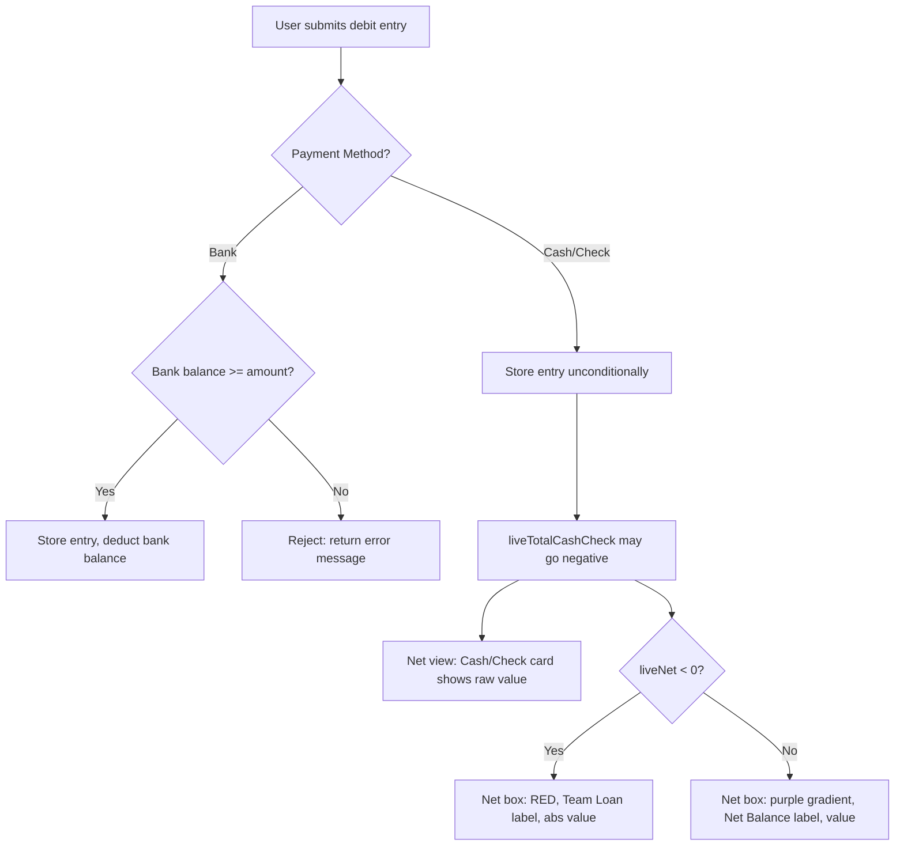

# Design Document

## Feature: cash-check-overdraft

---

## Overview

This feature introduces Cash/Check overdraft support to the wallet system. The change is intentionally narrow: it removes the balance pre-check for Cash/Check payments (allowing negative balances), leaves Bank payment validation completely untouched, and updates the net calculation view to communicate the overdraft state clearly to the user.

The net view already has partial overdraft awareness (it renders a red box when `$net < 0`), but it still shows a negative number and uses the label "Net Balance". This feature completes that UI by switching to a "Team Loan" label, showing the absolute value, and ensuring the Cash/Check asset card displays the raw (possibly negative) value rather than clamping it.

---

## Architecture

The change touches two layers:

1. **Controller logic** — `WalletController::storeEntry` already has the Cash/Check bypass comment in place. The Bank validation block is preserved as-is. No model or migration changes are needed.

2. **View rendering** — `resources/views/wallets/net.blade.php` needs two targeted updates:
   - The Net Calculation Box (result box) conditional logic.
   - The Cash/Check asset card to render the raw signed value.



---

## Components and Interfaces

### WalletController::storeEntry

- **Location**: `app/Http/Controllers/WalletController.php`
- **Responsibility**: Validates and persists wallet entries.
- **Change**: No code change required. The Cash/Check bypass is already implemented. This design confirms and documents the intended behavior.
- **Bank validation block** (preserved unchanged):
  ```php
  if ($method === 'Bank' && $data['type'] === 'pay' && !empty($data['bank_id'])) {
      $bank = Bank::find($data['bank_id']);
      if ($bank && $bank->balance < $data['amount']) {
          return back()->with('error', 'not enough money chooses some other bank/method')->withInput();
      }
  }
  ```

### WalletNetController::index

- **Location**: `app/Http/Controllers/WalletNetController.php`
- **Responsibility**: Computes live asset totals and passes them to the net view.
- **Change**: `$liveTotalCashCheck` is already computed as a signed sum (credits minus debits). No clamping is applied. This design confirms the value must be passed as-is to the view — no `max(0, ...)` wrapping.

### net.blade.php — Net Calculation Box

- **Location**: `resources/views/wallets/net.blade.php`
- **Current behavior**: Shows red background when `$net < 0` but still displays the negative number and "Net Balance" label.
- **Required change**: When `$net < 0`, display label "Team Loan", show `abs($net)`, keep red background. When `$net >= 0`, display label "Net Balance" with purple gradient and the actual value.

### net.blade.php — Cash/Check Asset Card

- **Location**: `resources/views/wallets/net.blade.php`
- **Current behavior**: Renders `{{ number_format($liveTotalCashCheck, 2) }}` — already shows the raw value.
- **Required change**: Confirm no clamping is applied. If `$liveTotalCashCheck` is negative, the card should display the negative number directly (e.g., `-12,500.00`).

---

## Data Models

No schema changes are required. All relevant models and their fields are unchanged.

| Model | Relevant Fields | Notes |
|---|---|---|
| `WalletEntry` | `type` (credit/debit), `amount`, `payment_method` | `payment_method` is encrypted; Cash/Check entries stored without balance check |
| `Bank` | `balance`, `wallet_id` | Encrypted; validated before Bank debit entries |
| `WalletNet` | `received_total`, `used_total`, `net_amount` | Encrypted snapshots; `net_amount` can be negative |

The `liveTotalCashCheck` value is computed at runtime in `WalletNetController::index` by summing wallet entries and customer transactions — it is not persisted. It can be negative when total Cash/Check debits exceed credits.

---

## Correctness Properties

*A property is a characteristic or behavior that should hold true across all valid executions of a system — essentially, a formal statement about what the system should do. Properties serve as the bridge between human-readable specifications and machine-verifiable correctness guarantees.*


### Property 1: Cash/Check debit always stored

*For any* debit wallet entry submitted with `payment_method = Cash/Check`, the entry shall be persisted regardless of the current Cash/Check balance — including when the resulting balance would be negative.

**Validates: Requirements 1.1, 1.2**

---

### Property 2: Bank debit stored if and only if balance is sufficient

*For any* Bank debit entry and any bank balance, the entry is stored if and only if the bank's current balance is greater than or equal to the requested amount. Entries where amount > balance are always rejected; entries where amount <= balance are always accepted.

**Validates: Requirements 1.3, 2.1**

---

### Property 3: Bank balance invariant after transaction

*For any* successful Bank debit entry of amount `A` against a bank with balance `B`, the bank's balance after the transaction equals `B - A`. For any rejected Bank debit entry, the bank's balance is unchanged.

**Validates: Requirements 2.3**

---

### Property 4: Negative net renders as Team Loan with absolute value

*For any* negative net balance value passed to the net view, the rendered Net Calculation Box shall: (a) contain the label "Team Loan", (b) not contain the label "Net Balance", (c) display the absolute (positive) value of the net amount, and (d) apply a red background style. No negative number shall appear in the box.

**Validates: Requirements 3.1, 3.2, 3.3, 3.5**

---

### Property 5: Non-negative net renders as Net Balance with actual value

*For any* net balance value greater than or equal to zero passed to the net view, the rendered Net Calculation Box shall contain the label "Net Balance", apply the purple gradient background, and display the actual net amount.

**Validates: Requirements 3.4**

---

### Property 6: Cash/Check live total is the raw signed sum

*For any* set of wallet entries and customer transactions, the computed `liveTotalCashCheck` value equals the exact signed sum of all Cash/Check credits minus all Cash/Check debits — and the Cash/Check asset card in the view displays that exact value without clamping, whether positive or negative.

**Validates: Requirements 4.1, 4.2**

---

## Error Handling

| Scenario | Handler | Response |
|---|---|---|
| Bank debit with insufficient balance | `WalletController::storeEntry` | Redirect back with error: `"not enough money chooses some other bank/method"`, input preserved |
| Cash/Check debit with any balance | `WalletController::storeEntry` | Always stored — no error |
| Bank not found during validation | `WalletController::storeEntry` | Guard: `if ($bank && ...)` — if bank is null, validation is skipped and entry proceeds (existing behavior) |
| Net view with negative `$net` | `net.blade.php` | Renders Team Loan state — no exception, no redirect |

No new exception types or HTTP error codes are introduced. The feature relies entirely on existing redirect-with-error patterns.

---

## Testing Strategy

### Unit Tests

Focus on specific examples and edge cases:

- **Example**: Submitting a Bank debit where `amount > balance` returns the exact error string `"not enough money chooses some other bank/method"` and does not create a `WalletEntry` record.
- **Edge case**: Bank debit where `amount == balance` (boundary) is accepted and stored.
- **Edge case**: Cash/Check debit where the resulting balance would be exactly zero — stored without error.
- **Edge case**: `liveTotalCashCheck` of exactly `0.00` renders the Cash/Check card as `0.00` (not negative, not clamped).
- **Edge case**: Net balance of exactly `0.00` renders the "Net Balance" label (not "Team Loan").

### Property-Based Tests

Use a PHP property-based testing library (e.g., [eris](https://github.com/giorgiosironi/eris)) with a minimum of **100 iterations per property**.

Each test must be tagged with a comment in the format:
`// Feature: cash-check-overdraft, Property {N}: {property_text}`

| Property | Test Description |
|---|---|
| Property 1 | Generate random Cash/Check debit amounts (including amounts > any balance); assert entry count increases by 1 each time |
| Property 2 | Generate random bank balances and debit amounts; assert stored iff `amount <= balance` |
| Property 3 | Generate random successful Bank debits; assert `bank.balance_after == bank.balance_before - amount` |
| Property 4 | Generate random negative net values; assert rendered HTML contains "Team Loan", abs value, red style, no negative sign |
| Property 5 | Generate random non-negative net values; assert rendered HTML contains "Net Balance", purple style, actual value |
| Property 6 | Generate random sets of Cash/Check credits and debits; assert `liveTotalCashCheck == sum(credits) - sum(debits)` and the card displays that exact value |

Property tests and unit tests are complementary — unit tests catch concrete bugs at known boundaries, property tests verify general correctness across the full input space.
